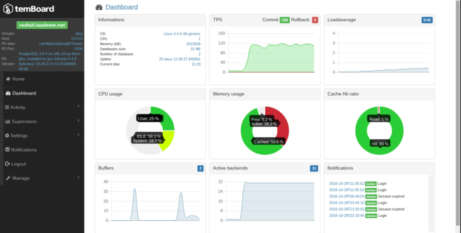

Temboard is a powerful mangement tool for PostgreSQL. 

You can use it monitor, optimize or configure multiple PostgreSQL instances.

Temboard is composed of 2 basic elements:

* A lightweight **agent** that you need to install on every PostgreSQL server you want to manage

* A central **server** to control the agents and collect metrics

# Demo

# Install 

Please read our [doc/index.md](doc/index.md) or go to  [http://temboard.readthedocs.io](http://temboard.readthedocs.io/en/latest/)

# Contribute

Temboard is an open project. Any contribution to improve it is welcome. 

# License

Temboard is available under the [PostgreSQL License](LICENSE).

