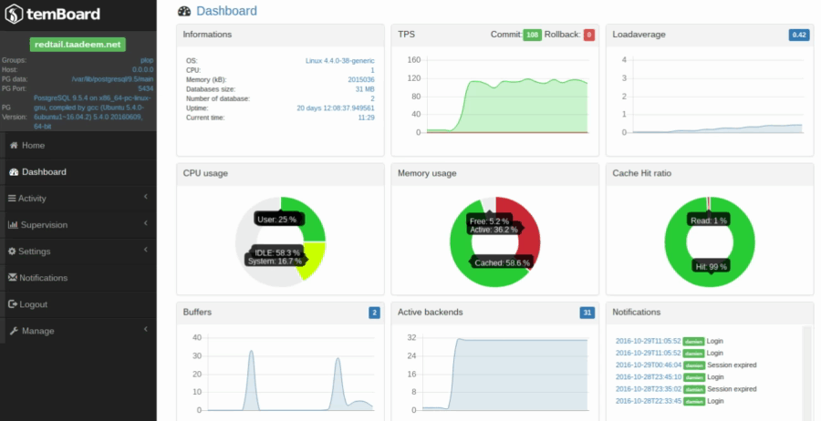

Temboard is a powerful mangement tool for PostgreSQL. 

You can use it monitor, optimize or configure multiple PostgreSQL instances.

Temboard is composed of 2 basic elements:

* A lightweight **agent** that you need to install on every PostgreSQL server 
  you want to manage

* A central **server** to control the agents and collect metrics

# Demo

## Dashboard Overview 

## Changing a Parameter

# Quick Start

We're providing a complete testing environment based on docker:

Please read our [QUICKSTART](QUICKSTART.md) guide for more details.

# Install 

Please read the doc here: <http://temboard.readthedocs.io/en/latest/>.

# Contribute

Temboard is an open project. Any contribution to improve it is welcome. 

# License

Temboard is available under the [PostgreSQL License](LICENSE).

