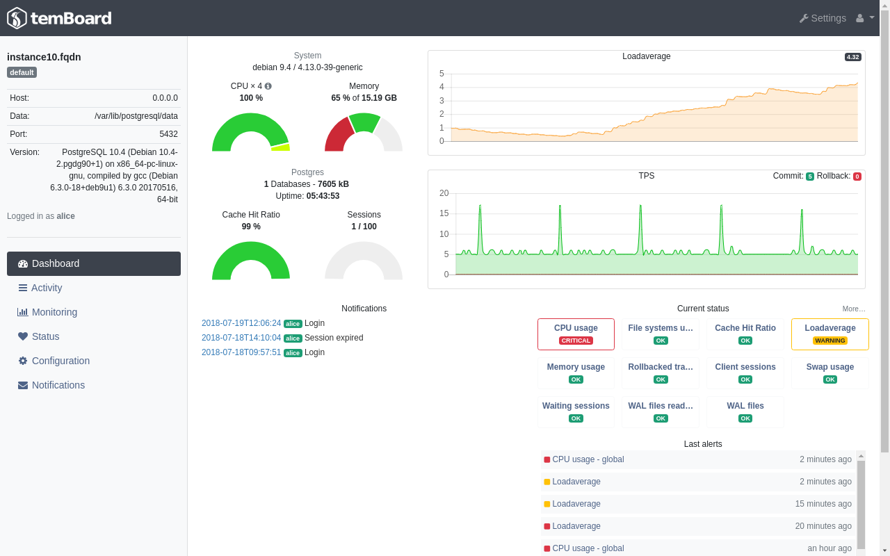
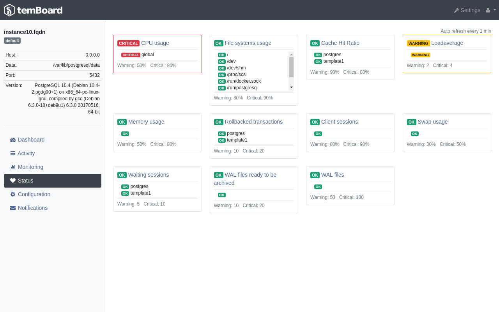
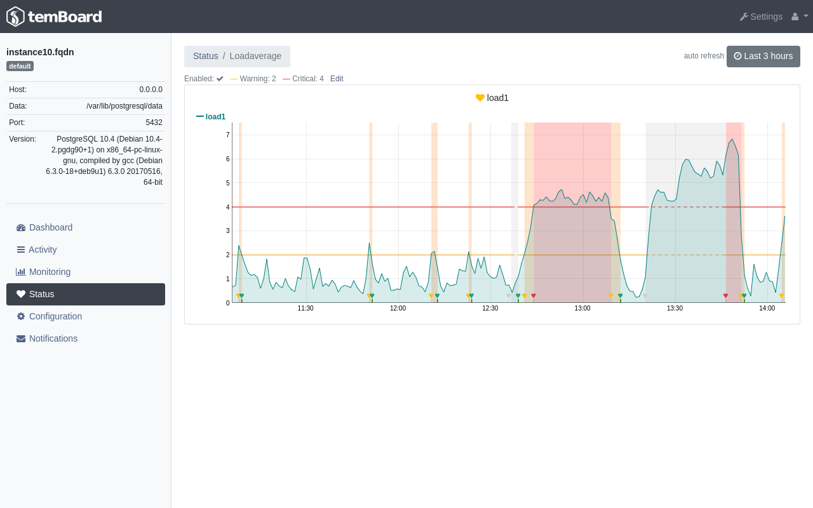

# Alerting

Note: `alerting` is part of the `monitoring` plugin. This means that you need
to activate the `monitoring` plugin in order to take advantage of `alerting`.

The main goal of the `alerting` in temBoard is to compare values for
monitored metrics with **warning** or **critical** thresholds. It then allows
users to get notified if something gets wrong on the Postgres instance.

## Current status and previous alerts in dashboard

When activated, `alerting` can show some information on the dashboard page.

First of all, the current status for the different probes are displayed.

Also users will find the last 20 alerts. In this case, an "alert" means that
a change from a status level to an higher one has been detected.

Statuses and alerts are updated every minute to match the last check.

## Current Probes Status Detailed

Statuses for all monitored probes are also shown in a more detailed view in the
status page.

## Probe Status Over Time

By clicking on probe name, one can also get access to an even more detailed
view for each probe. In this view, users will find:

 - the current status,
 - the thresholds values over time,
 - the values for the monitored probe over time,
 - the past alerts (ie. status change),
 - the time ranges for which the status was `warning` or `critical` or if the
     check was disabled.

On this page, users will also be able to enable/disable the checks and
configure the thresholds.

Please beware that the thresholds are configured for each instance.

## Auto-refresh

Every UI component detailed above this section are refreshed every minute to
match the last checks.
