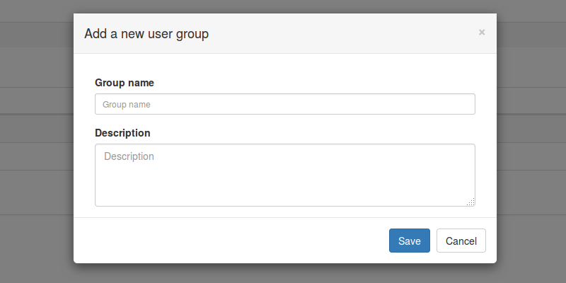
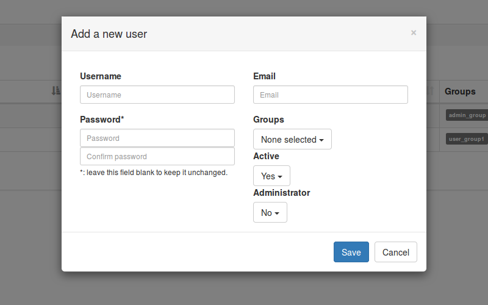
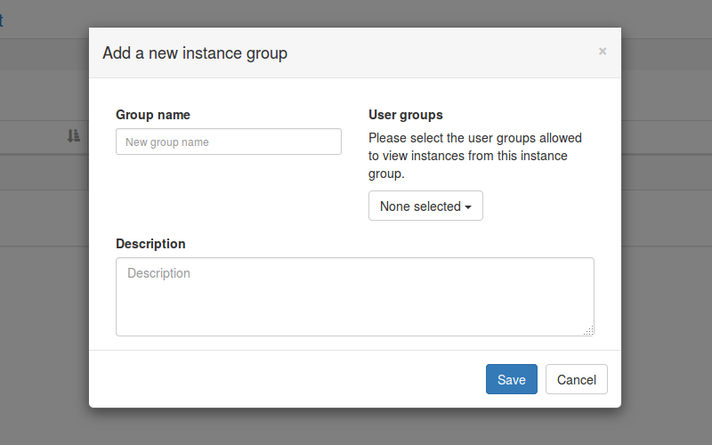
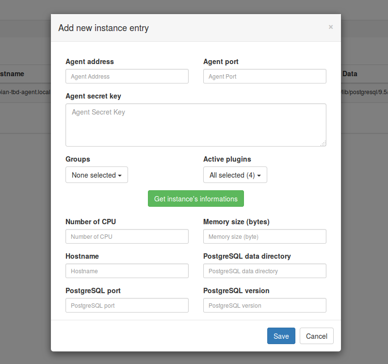

# First connection

Once `temboard` installed and running, it's time to try a first connection to the web interface with HTTPS on port `8888`: `https://localhost:8888/`

You'd get a login box, default administration account is `admin`, password `admin`. Obviously, this password must be changed as soon as possible. To edit user's profile, please go to `Manage` -> `User list` -> `Edit` on the corresponding row.

Currently, when a logged in user changes its password, the error message `Restricted area...` is raised, this behaviour is due to the expiration of user session when the password is changed. Go back to the login page and fill the form with the new password.

# User and user group creation

User acces controls to instances managed by `temboard` are based on `groups` belonging. Each `instance` can belong to N `instance group`, each `user` can belong to N `user group`. Each `user group` is granted or not to acces an `instance group`.
You must be logged in with a user having administration privileges.

## User group creation

Go to `Manage`-> `User groups`, then `+ Add new user group`. Please fill the form and `Save`.

### User group attributes

  * `Groupe name`: Groupe name, must be unique;
  * `Description`: Group description.

## User creation

To add a new `user`, go to `Manage` -> `Users`, then `+ Add new user`.

### User attributes

  * `Username`: User name used for login, must be unique;
  * `Password`: User password;
  * `Email`: User email address;
  * `Groups`: `user groups` list the user belongs to;
  * `Active`: Is the user active or not, if not he won't be able to login;
  * `Administrator`: Does the user get administration rights to create other users, instances etc..

# Add a new instance

You must be logged in with a user having administration privileges.

## Create a new instance group

To create a new `instance group`, go to `Manage` -> `Instance groups`, then `+ Add new instance group`.

### Instance group attributes

  * `Group name`: Groupe name, must be unique;
  * `Description`: Groupe description;
  * `User Groups`: List of `user group` allowed to acces `instances` from this `instance group`.

## Create a new instance

Go to `Manage` -> `Instances`, then `+ Add new instance`.

### Instance attributes

  * `Agent address`: IPv4 address that the agent is listening on; 
  * `Agent port`: Port number that the agent is listening on;
  * `Agent secret key`: Authentication key used by the agent to send data to the collector (`supervision` plugin only);
  * `Groups`: Instance groups this instance belongs to.
  * `Active plugins`: `plugins` enabled for this instance. Selected `plugins` must be loaded by the `agent` too.

Once `Agent address` and `Agent port` filled, if the `agent` is up & running, it's possible to retreive values of the following attributes by clicking on the button `Get instance's informations`.

  * `Number of CPU`
  * `Memory size`
  * `Hostname`
  * `PostgreSQL data directory`
  * `PostgreSQL port`
  * `PostgreSQL version`
