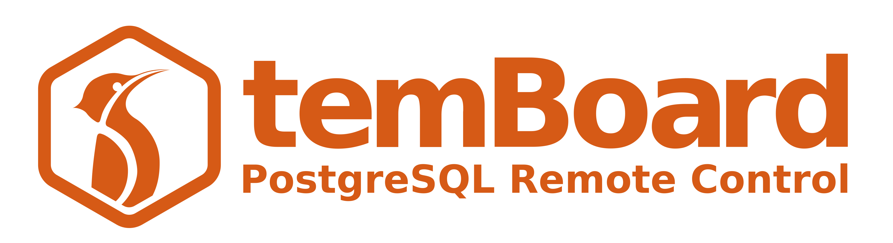
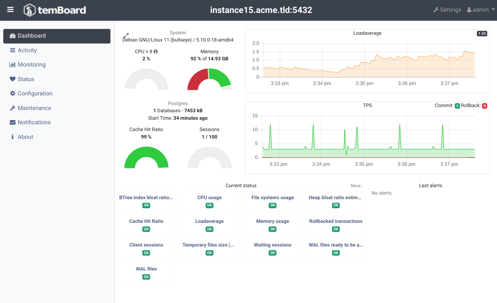

---
hide:
- navigation
---

<!-- Disable auto-h1 from https://github.com/squidfunk/mkdocs-material/blob/922fde070166898cbde561739670e1249423abe2/material/overrides/partials/content.html#L8-L10 -->
<h1 class="display-none"></h1>

{ .no-lightbox .logo }

temBoard is a powerful management tool for PostgreSQL.
You can use it to monitor, optimize or configure multiple PostgreSQL instances.

# Features

- Manage hundreds of instances in one interface.
- Fleet-wide and per-instance dashboards.
- Monitor PostgreSQL with advanced metrics.
- Manage running sessions.
- Track bloat and schedule vacuum on tables and indexes.
- Track slow queries.
- Tweak PostgreSQL configuration.

All of this from a web interface.

{ loading=lazy }

# Quickstart

You can run a complete testing environment based on Docker Compose,
follow the [quickstart](quickstart.md) guide for more details.

# Install

temBoard requires Python 3 and supports PostgreSQL 9.6 to 15.
temBoard is composed of 2 services:

- A lightweight agent to install on every PostgreSQL server to monitor and manage.
- A central server controlling the agents, collecting metrics and presenting it on a web UI.

Dalibo ships packages for RHEL and Debian systems.
For a regular installation, follow the [Installation guide](server_install.md).

# About

temBoard is open source software, developed by [Dalibo Labs] and availabled under the [PostgreSQL license].

[PostgreSQL license]: https://github.com/dalibo/temboard/blob/master/LICENSE
[Dalibo Labs]: https://labs.dalibo.com/
