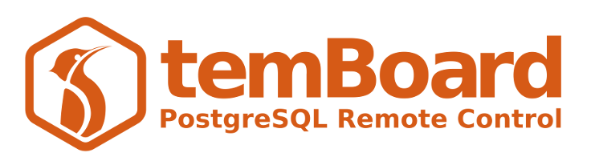

!!! warning

    **[temBoard 8 is available !](https://blog.dalibo.com/2022/11/14/temboard8-en.html)**

    You are reading the documentation of an **old** version.

    Do you want to read [temBoard v8 documentation](https://temboard.rtfd.io/en/latest/) ?

temBoard is a powerful management tool for PostgreSQL. You can use it to monitor, optimize or configure multiple PostgreSQL instances.

temBoard is composed of 2 basic elements:

- A lightweight agent to install on every PostgreSQL server to monitor and
  manage.
- A central server controlling the agents, collecting metrics and presenting it on a web UI.

You can set up a complete testing environment based on docker,  follow the
[QUICKSTART](QUICKSTART.md) guide for more details.

For a regular installation, follow the [Installation guide](server_install.md).
