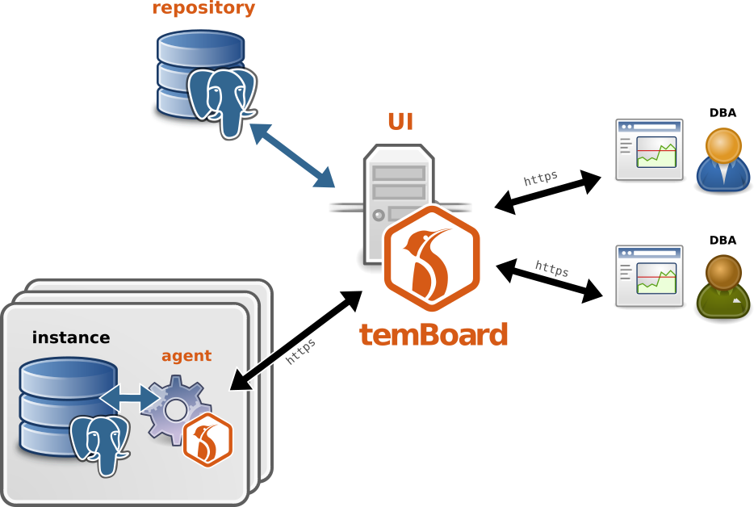

<h1>Install the server</h1>

temBoard is designed with three distinct components:

- **repository** - a Postgres database to store users, instances list and
 monitoring data.
- **UI** - the main web interface.
- **agent** - a standalone daemon attached to a single Postgres cluster to manage.


The following diagram illustrates the global architecture of temBoard.



This document guides you to quickly setup all these components together.


# Prerequisites

temBoard UI requires:

- Python 3.9+.
- openssl
- bash, sudo and psql for setup script.


# Prepare

Before installing temBoard UI, ensure you have a running PostgreSQL 13+ instance.
The auto-configuration script works well with a local Postgres cluster, running as UNIX user `postgres`.
If it's not the case, post-inst script will fail gracefully and let you handle the configuration later.

!!! note

    To ensure browsing of the web interface is fast enough, please note `work_mem`
    parameter PostgreSQL cluster hosting the repository should be set to at least
    `16MB`.

A simple way to check if auto configuration should work is to run:

``` console
# sudo -u postgres psql
```

If this fails, find the proper PG* env vars to connect to your Postgres instance.
Keep them for later use by auto-configuration script.


# Install


=== "RHEL"

    [Dalibo Labs YUM repository](https://yum.dalibo.org/labs/) serves latest stable RPM for temBoard.
    Start by enabling Dalibo Labs YUM repository.

    ``` console
    $ sudo yum install -y epel-release
    $ sudo yum install -y https://yum.dalibo.org/labs/dalibo-labs-4-1.noarch.rpm
    ```

    !!! warning

        Do **NOT** use temBoard rpm from PGDG. They are known to be broken.

    With the YUM repository configured, you can install temBoard UI with:

    ``` console
    $ sudo yum install temboard
    $ temboard --version
    ```

    **Offline install**

    Some production infrastructure are offline for security reasons. In this
    situation, the temboard package and its dependencies can be dowloaded with
    the following commands :

    ``` console
    $ sudo yum install yum-utils
    $ yumdownloader --resolve --destdir /tmp/temboard-packages temboard
    ```

    Then the downloaded packages can be transfered to the production server and
    installed with

    ``` console
    $ yum --disablerepo=* localinstall *.rpm
    ```


=== "Debian"

    [Dalibo Labs APT repository](https://apt.dalibo.org/labs/) serves DEB packages fro temBoard.
    Start by enabling Dalibo Labs APT repository.

    ``` console
    # echo deb http://apt.dalibo.org/labs $(lsb_release -cs)-dalibo main > /etc/apt/sources.list.d/dalibo-labs.list
    # curl -fsSL -o /etc/apt/trusted.gpg.d/dalibo-labs.gpg https://apt.dalibo.org/labs/debian-dalibo.gpg
    # apt update
    ```

    You can now install temBoard with:

    ``` console
    # apt install temboard
    # temboard --version
    ```


# Configure

Call the script `/usr/share/temboard/auto_configure.sh`
with libpq-style envvars (eg. `sudo PGPORT=5433 /usr/share/temboard/auto_configure.sh`)
required to connect to repository.

The postinst script creates
self-signed SSL certificate, UNIX user, configuration file and systemd unit,
as well as Postgres role, database and tables for temBoard UI.
A few steps are left to the administrator.

The configuration file `/etc/temboard/temboard.conf` should suit most people.
See [Configuration](server_configure.md) and customize if default port
or directories don't match your local needs,
or increase security by changing the certificate and the cookie secret key.

!!! danger "Default admin user"

    By default, temBoard is set up with a dumb `admin` user with password `admin`.
    This is totally unsecured.
    It is **strongly recommended to change default password**! See below.

First, start temboard using `systemctl enable --now temboard`.

You may need to open port using :

``` console
$ sudo firewall-cmd --add-port 8888/tcp --permanent
$ sudo firewall-cmd --reload
```

Adapt to your setup.
Then point your browser to <https://temboard_server_host:8888>,
log in as `admin:admin` and change the password.

!!! note "Using firewall"

    To increase security, you may protect temBoard using
    a firewall rule, until the quickstart admin is secured.


# Instances

Once the UI is up and running,
you can proceed to agent installation and setup on each host you want to manage.
See the dedicated [agent installation](agent_install.md) documentation for this.

Then, when all instances show up in temBoard,
go further with the [Howto](temboard-howto.md).
