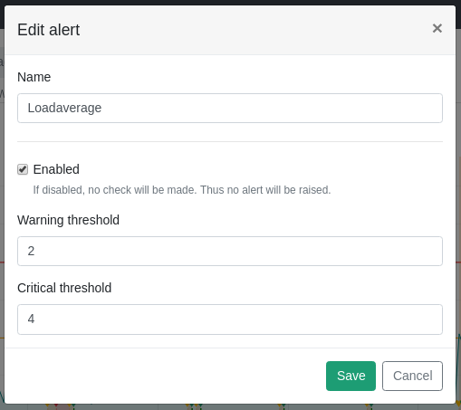
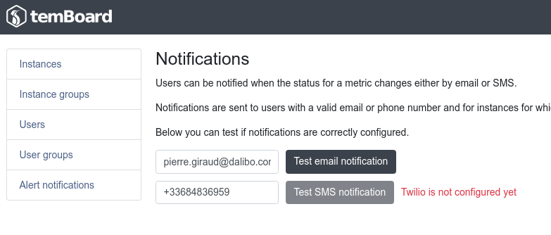
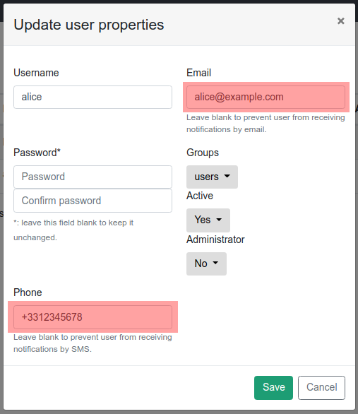

Note: `alerting` is part of the `monitoring` plugin. This means that you need
to activate the `monitoring` plugin in order to take advantage of `alerting`.

The main goal of the `alerting` in temBoard is to compare values for
monitored metrics with **warning** or **critical** thresholds. It then allows
users to get notified if something goes wrong on the Postgres instance.

## Current status and previous alerts in dashboard

When activated, `alerting` can show some information on the dashboard page.

First of all, the current status for the different probes are displayed.

Also users will find the last 20 alerts. In this case, an "alert" means that
a change from a status level to a higher one has been detected.


Statuses and alerts are updated every minute to match the last check.

## Current Probes Status Detailed

Statuses for all monitored probes are also shown in a more detailed view in the
status page.


## Probe Status Over Time

By clicking on probe name, one can also access an even more detailed
view for each probe. In this view, users will find:

 - the current status,
 - the thresholds values over time,
 - the values for the monitored probe over time,
 - the past alerts (ie. status change),
 - the time ranges for which the status was `warning` or `critical` or if the
     check was disabled.


On this page, users will also be able to enable/disable the checks and
configure the thresholds.

Please beware that the thresholds are configured for each instance.



## Auto-refresh

Every UI component detailed above this section are refreshed every minute to
match the latest checks.

## Notifications

temBoard is able to send a notification (Email or SMS) when the status for
a metric on an instance changes.


### General Configuration

First of all transport systems (SMTP or SMS Twilio service) need to be
configured.

In your `temBoard` configuration file you need to add the following section:

```yaml
[notifications]
# SMTP host
smtp_host = smtp.gmail.com
# SMTP port
smtp_port = 465
smtp_tls = True
smtp_login = <email>@gmail.com
smtp_password = <password>

# Twilio SMS service configuration
twilio_account_sid = <account_id>
twilio_auth_token = <auth_token>
twilio_from = <from_number>
```

Note: you can leave the settings commented if you don't want to use them.

The above example shows how to configure the SMTP for sending emails via Google
Mail. The password may be an application password in case you're using
2-Step-Verification. See [Sign in using App
Passwords](https://support.google.com/accounts/answer/185833).

If you use your own SMTP service, you may also want to set the sender FROM address:
```yaml
smtp_from_addr = <email>@mydomain.com
```

For the twilio settings, please refer to [Twilio Usage Documentation](https://www.twilio.com/docs/usage).

Once the configuration seem to be OK, admin users can send test mails or SMS by
clicking on the dedicated buttons in the `Alert notifications` tab.



### Users and Instances Settings

In order to get notified, admin users have to set an *Email* or *Phone number*
to the users.



Notifications also have to be turned on at the instance level.


