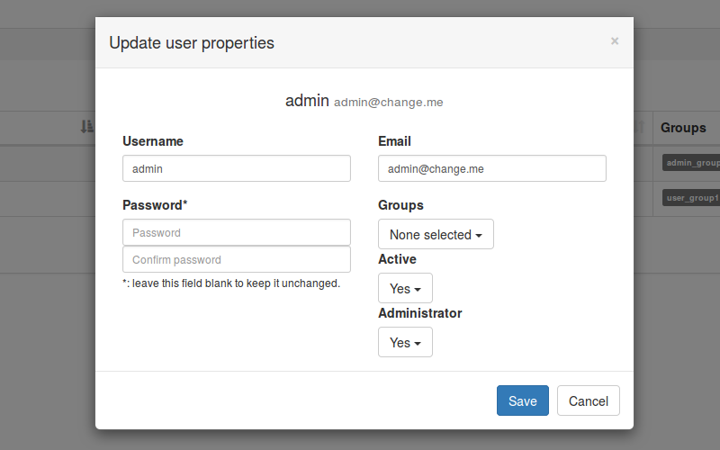
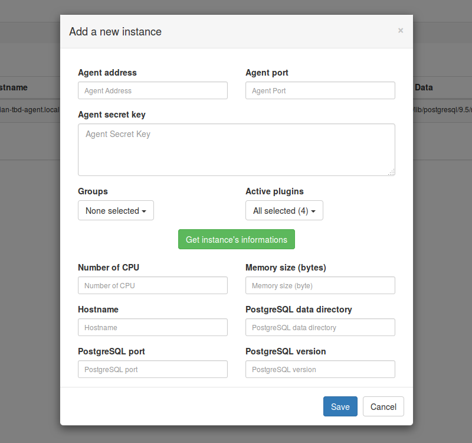
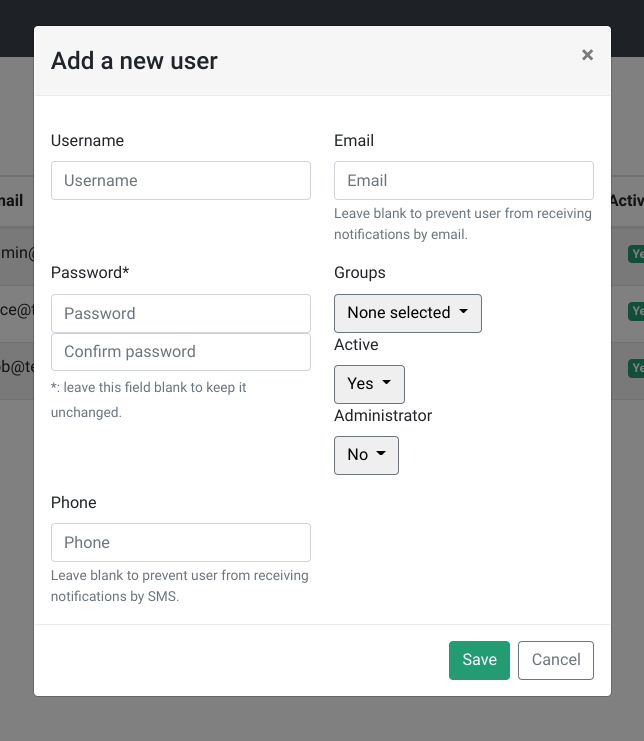

# First connection

Once `temboard` is up and running, it's time to try a first connection to the
web interface with a web browser using `https` at the address
`https://<temboard-host>:8888/`.

You should get a login box. The default administration account is `admin`, the
password is `admin`. Obviously, this password **MUST** be changed as soon as
possible. To edit user's profile, please login and go to `Settings` -> `User
list` then `Edit` on the corresponding row.

Currently, when a logged in user changes its password, the error message
`Restricted area...` is raised, this behaviour is due to the expiration of user
session when the password has been changed. Go back to the login page and fill
the form with the new password.

# Managing instances

You must be logged in with a user having administration privileges.

## Add a new instance

For each instance you want to manage, [install and configure one agent](agent_install.md).
To register the instance graphically,
go to `Manage` -> `Instances`, then `Add a new instance`.

You must fill temBoard agent address and port.
Don't confuse with PostgreSQL server address and port.
temBoard will contact the agent and present you informations to identifiy the monitored instance.

You can now configure Environment and features enabled for this instance.
Each instance must be in one Environment.
Environment determines which users will have access to the instance.

# Manage users

Once you have an Environment and an instance registered,
share management access to someone by creating a user.

## Add a new user

Go to `Settings` -> `Users`, then `New user`.
You must define the password.
Only administrators can change password.

Once user is created, allow him to access to the instance by adding him to the Environment.
Go to `Settings` -> `Environments`,
then click the :fontawesome-solid-users: icon on the corresponding row.
Click `Add member` in this page and search for *alice*.
Click on username to allow him to the Environment.

Once a user has access to an environment,
he can manage instances in this environment.

# Reset your password

Currently, the password reset feature depends on the notification settings specified in the temboard configuration file.
[Please, see the Notifications section](temboard-howto-alerting.md#Notifications).
